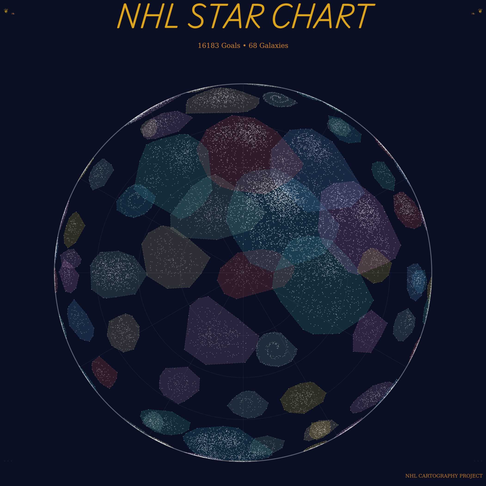

# NHL Cartography
Every goal scored in the NHL can be thought of as a location in time and space. This project captures those locations, groups them based on similarity, and maps them. 


## Background
This project is directly inspired by the [Map of Github](https://anvaka.github.io/map-of-github) and uses many of the same concepts. Goal data is soured from the [NHL API](https://github.com/Zmalski/NHL-API-Reference). The UI is entirely "vibe coded" with the aid of Claude Code. An AI agent was used in the development and exploration of the clustering process but it is mostly my code. It is also my code for pulling the data. I used this project as a way to explore the current state of AI tools and had some fun with a dataset I am familiar with. This entire project is meant to be fun and not intended for any real deep dive into the data.

## The Data
The NHL provides pretty comprehensive data in 2025 about where and how goals were scored. The key is that this push to record this information is a relatively newer effort. If you examine the goal files I have, it extends all the way back to every goal ever scored in the NHL. My reasons for only using 2023+ are as follows:
- Shot coordinates and situation were included for goals in the 2010s and I knew I wanted this to be the main feature of the clustering algoriths so that really became my "floor" of when to begin
- Part of the fun of seeing similar goals is literally "seeing" them. Starting in 2023 the NHL started to add highlight URL so you can have a video link to the goal
- There was performance/legibility considerations knowing how many goals would have to be rendered in browser

## Clustering
The project doesn't necessarily represent this but there was a ton of time put into figuring out the best way to cluster the data. One issue is that most of the data I wanted to use was discrete value on large scales(x,y coordinates, game time, even situation has a lot of permutations). In order to address this, I applied some domain knowledge and performed some groupings before attempting to cluster. I divided the offensive zone into 7 "zones"(left point, point, right point, left faceoff circle, slot, right faceoff circle, not in OZ). These names aren't traditional and the grouping is arbitrary in the sense you don't normally hear people group things like this but it helped to reduce the range of values a coordinate could appear in and made clustering significantly easier. 

The clustering itself is done using the UMAP algorithm to reduce the dimensionality further and HDBSCAN to perform the clustering. The choices came with a lot of trial and error. I found HDBSCAN to create the highest quality clusters and UMAP aided in reducing dimensionality. 

## Mapping
The mapping coordinates are generated using controlled randomness. There are some shapes inspired from real astrological concepts like a spiral galaxy and circular solar systems but they really are just random points in space. Its just that cluster integrity is maintained and placed at similar points. The points are generated and then placed in GeoJSON format and rendered in the UI.

## Generating Names
An LLM was used to name the celestial objects. The prompt used is as follows:
```
You are tasked with creating a <celestial level> name for a project which maps all of the goals scored in the NHL into a constellation map. The name should make sense based on the attributes of the goals contained in the cluster and should resemble names used in astronomy for our real universe.
Please provide only the name (2-3 words maximum), no explanation. The name should be evocative of the goal characteristics and follow astronomical naming conventions. Do not use a name in goalies faced unless a goalie name appears 4 or more times based on the provided context(we are using pandas value_counts() to get the count). For situations, 5v4, 6v4, 5v3, 4v3 are powerplays and 4v5, 4v6, 3v5, 3v4 are shorthanded. 5v6 is on an empty net and 6v5 is scoring with an extra player because your net is empty.
Some context for the goals in this grouping are: <data context>.
```

## UI
I am not as well versed in writing UIs so I leaned heavily on AI for this. I was excited to try out the SOTA models and Claude Code was pretty much exclusively used. I had an idea in my head of what I wanted and was able to create it. It seems to work well. Is the code good? I doubt if you asked an expert they would say yes, but I was happy with the result and it was done better/faster than if I had just tried on my own. You can see the CLAUDE.md file I used.

A little about the UI, it is split into 2. A "static" star chart and a "free roam" star chart. The free roam UI was the original idea but after some early feedback, it was way too difficult to use on mobile and perhaps a little too hard to understand. This led me to the static version. More focused on generating constellations, this UI is much easier to use on mobile and I think its easier for people to pick up and just "get". Its a fun way to visualize what the clustering is doing and to view your favorite players goals.

I left the free roam up because I think its a better way to view the clusters at your leasiure. Just be warned that it works better on desktop than mobile and can be confusing.


## Additional
- The font used in the visualization is from [amorphous](https://amorphous.itch.io/beholden)